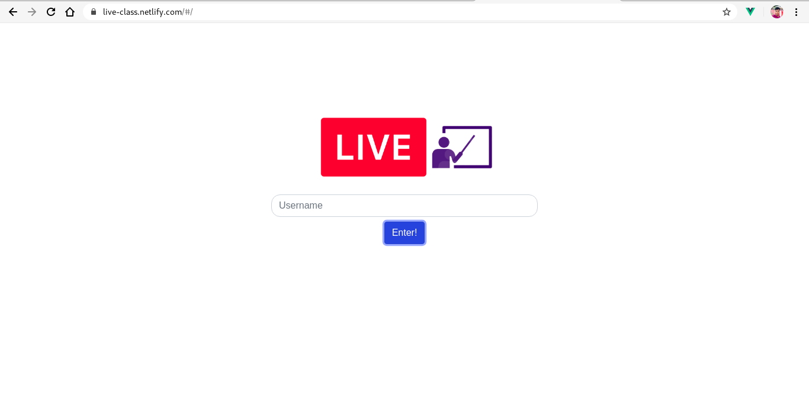
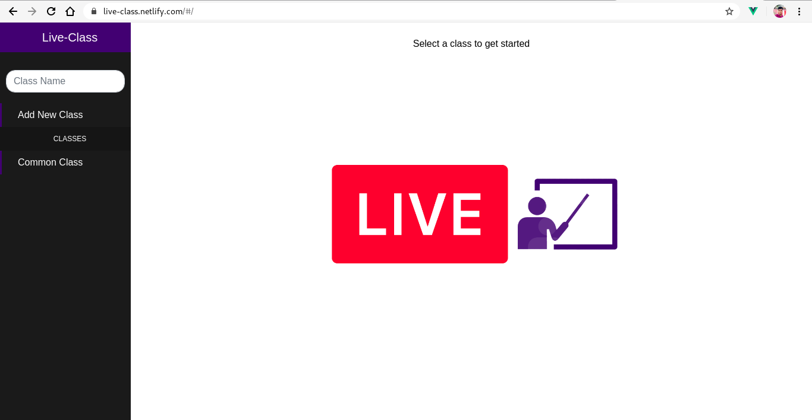
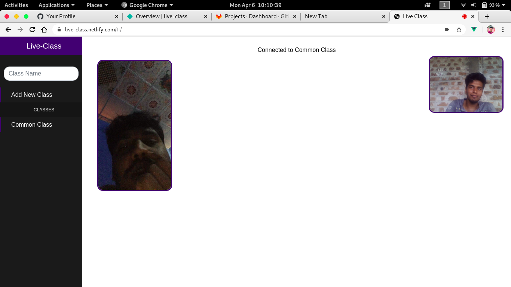
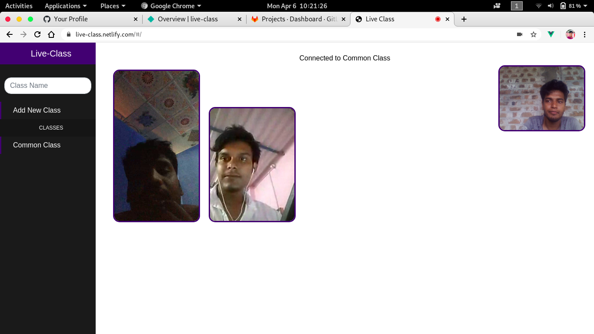

<a  href="https://www.twilio.com">

</a>

# This application has been developed on Twilio Hackathon using Twilio API + Vue.js + nodejs #twiliohackathon

## [Live DEMO https://live-class.netlify.com/#/](https://live-class.netlify.com/#/) 
   
## Requirements 

To run this project, you need to have:

- [Node.js](https://nodejs.org/) installed on your system
- A server for generating a token. Clone and install it [here](https://github.com/Katheesh/live-class.git).

## Setup Node Server

Clone the repository:

``` bash
 git clone https://github.com/Katheesh/live-class.git
```
cd into the nodejs server project:
``` bash
cd live-class/Nodejs Server
```
Install dependecies:

``` bash
npm install
```
Set up the .evn file variables
Run the Server!

``` bash
node server.js

```
## Setup Vue Project

cd into the project:
``` bash
cd live-class
```

Install dependecies:

``` bash
npm install
```

Run the app!

``` bash
npm run dev
```

The app should now be accessible from http://localhost:8080

<p align="center">
	
</p>


## This Application Screenshots

<p align="center">
	<h3>Homepage</h3>
	<br>
	<h3>Dashboard</h3>
	<br>
	<h3>Two Users Live</h3>
	<br>
	<h3>Three Users Live</h3>
	<br><br>
</p>


## Credits

The app is based on data from : https://twilio.com

## License

MIT © [Katheesh](LICENSE) #twiliohackathon

## Disclaimer

No warranty expressed or implied. Software is as is.

[twilio]: https://www.twilio.com
